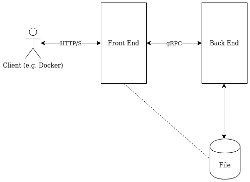
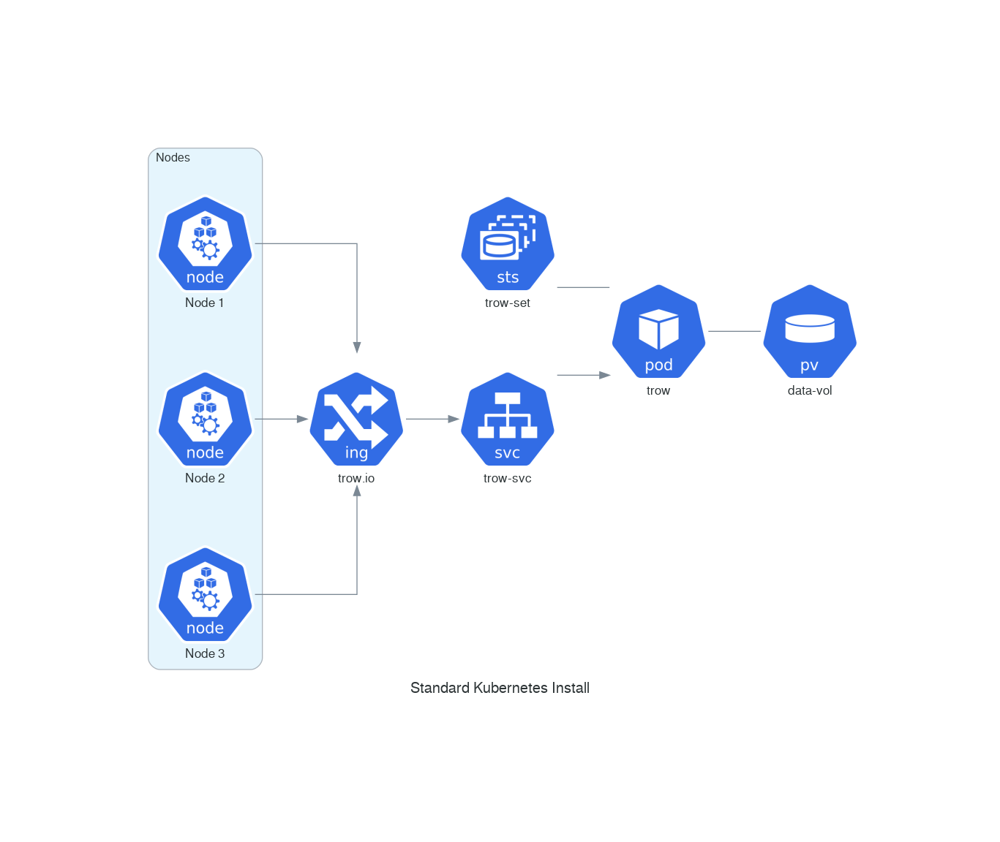

# Trow Architecture

The following diagram depicts Trow running standalone (outside of a cluster).

It's worth noting the following:

 1. All interaction with clients (normally the Docker Daemon, but also podman, CI/CD tools etc) is
    currently via a RESTful (ish) API interface. The interface is defined by the OCI Distribution
    spec, although Trow adds a few features of its own.

 2. The architecture is split into a "Front End" and a "Back End" The Front End deals with HTTP/S
    requests and makes gRPC calls to the "Back End" for handling registry operations like saving or
    retrieving blobs. 

    At the moment, this split doesn't buy us much, but hopefully in the future it
    will allow more flexible deployment models for Trow (for example a single Front End serving
    multiple Back Ends, or a Front End talking to a Back End on a remote node, or new interface
    types for clients like gRPC).
    
    At the moment, both the Front End and Back End are compiled into one executable. 

    Yes, Front End and Back End are bad terms, please feel free to suggest alternatives.

 3. Trow saves image data to file. There aren't currently any options to use different storage like
    S3.  This still allows a considerable deal of flexibility as it can be backed by multiple volume
    types, but at the same time we avoid the complexity of handling the error states of remote
    storage such as S3. 

    Currently, the Back End hands file pointers to the Front End to send onto clients. In the future
    this could be replaced with other methods e.g. a network stream to read from. This is the reason
    for the dashed line between the file system and the Front End

Trow is implemented in Rust. The Front End currently uses the Rocket web framework, but this may
change in the future. The gRPC communication is handled via Tonic. 

## Typical Kubernetes Deployment

The standard install will result in a deployment like this:

Trow data is backed to a volume, for example Google Persistent Disk. A StatefulSet rather than a
Deployment is used. This is required to handle updating Trow and reattaching the volume correctly.
All clients, including Kubernetes Nodes themselves connect to the registry via the Ingress. This
requires the Ingress to be provisioned with a certificate in some way e.g. cert-manager or Google
Managed Certificate.

The quick install takes a slightly different approach, with Kubernetes CA signed TLS certificates
and a NodePort for ingress.  Routing in this case is achieved by editing `/etc/hosts` on the nodes
and client as well as adding the Trow cert to the appropriate stores. This works well for testing,
but is a hack that shouldn't be used in production.

## Advanced Distribution Deployment

The plan for the future is to have something more like this:

Every (or most) nodes run an instance of the Trow Back End. These instances communicate and share
files with each other in a P2P style (similar to BitTorrent). This should provide an enormous speed
in up in image deployment time for the cluster. It should also be designed to place minimal extra
load on nodes.

There is a single (or perhaps several) Front End instances for talking to clients. 

## Upload/Download Tracking and File Layout

